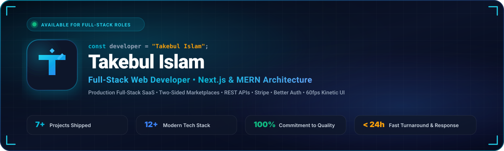
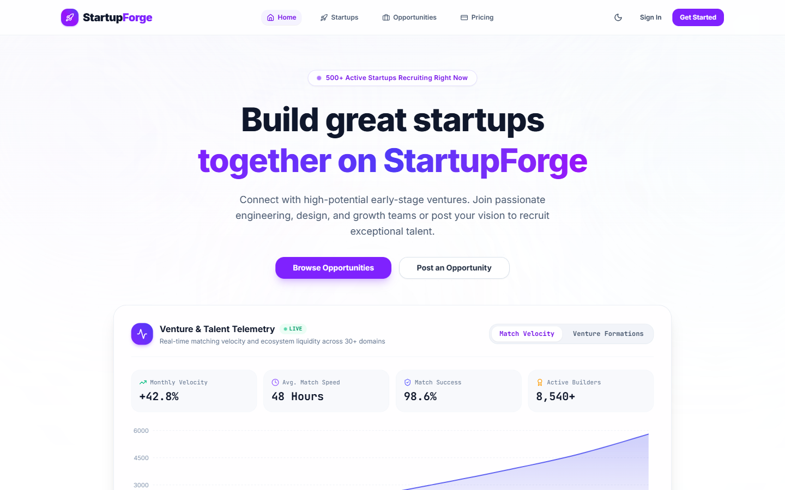
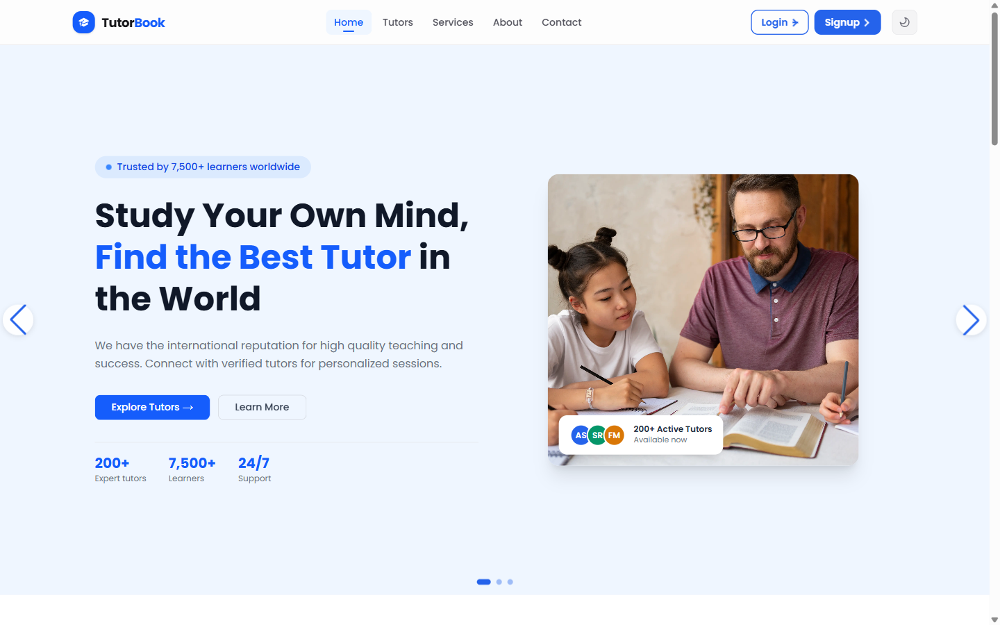
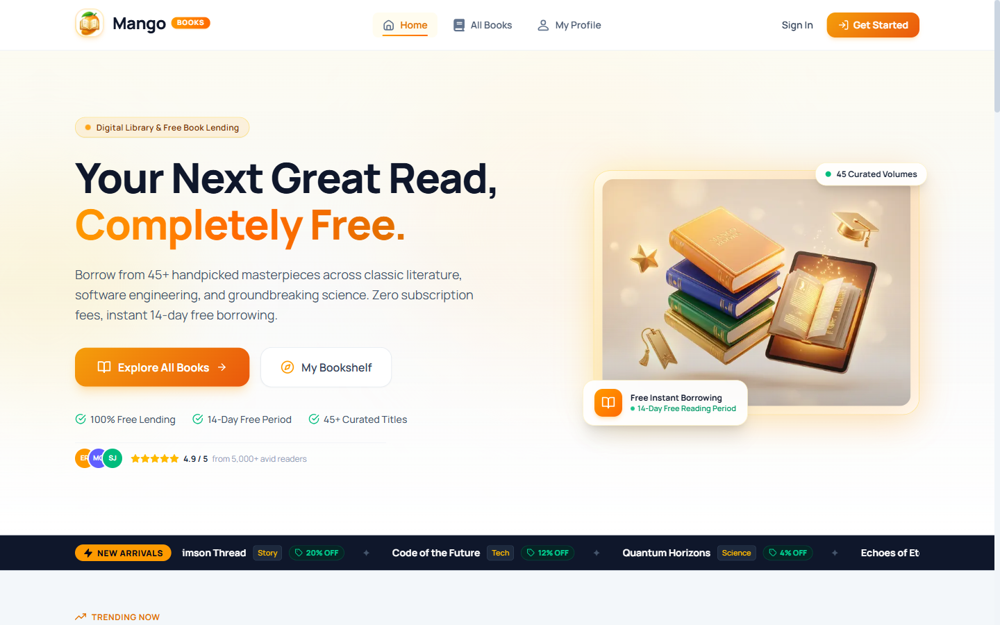
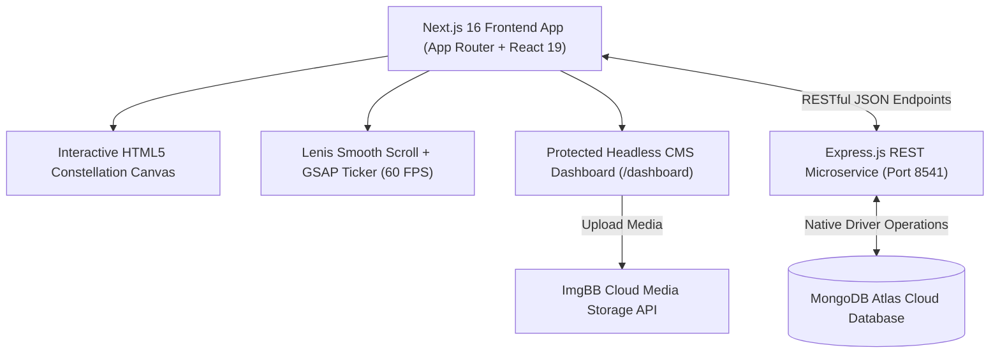

<div align="center">

  <!-- Retinal Cyberpunk Banner -->
  

  <br />
  <br />

  <!-- Status & Tech Badges -->
  <p align="center">
    <a href="https://takebulislam.dev">
      
    </a>
    <a href="https://nextjs.org">
      
    </a>
    <a href="https://react.dev">
      
    </a>
    <a href="https://nodejs.org">
      
    </a>
    <a href="https://expressjs.com">
      
    </a>
    <a href="https://www.mongodb.com/atlas">
      
    </a>
    <a href="https://tailwindcss.com">
      
    </a>
    <a href="https://stripe.com">
      
    </a>
    <a href="https://gsap.com">
      
    </a>
  </p>

  <!-- Navigation Pill Links -->
  <p align="center">
    <a href="https://startupforgelimited.vercel.app"><b>🚀 Featured Work</b></a> •
    <a href="https://docs.google.com/document/d/1WRY3zXw2sC7Yz-AT9gkw7APiPQ5o9vRXBxy0EzppeZY"><b>📄 View Resume</b></a> •
    <a href="https://www.linkedin.com/in/takebulislam"><b>💼 LinkedIn Profile</b></a> •
    <a href="https://github.com/takebul"><b>🐙 GitHub Profile</b></a> •
    <a href="mailto:takebulislam@gmail.com"><b>📫 Direct Email</b></a>
  </p>

  <p align="center">
    <strong>Crafting scalable full-stack web platforms, modern interactive architectures, and resilient backends.</strong>
  </p>

</div>

---

## 🎯 Executive Summary for Technical Recruiters & Engineering Leads

Hi there! I'm **Takebul Islam**, a Full-Stack Web Developer specialized in the modern JavaScript ecosystem (**React 19, Next.js 16, Node.js, Express.js, and MongoDB Atlas**).

Unlike typical tutorial-based portfolios, this repository is a **production-grade web application** coupled with an independent **Express REST microservice** and **MongoDB Atlas** database. It features 60 FPS kinetic physics, zero-FOUC theme state hydration, dynamic SEO metadata generation, and a protected headless CMS dashboard.

### 🌟 Why Hire Takebul?
* **Full Lifecycle Ownership:** From Figma-to-Code and responsive UI to normalized MongoDB schemas, RESTful controllers, stateless JWT authentication, and edge deployments.
* **Production-Grade Security:** Implemented RBAC middleware, Google OAuth, Better Auth with remote JWKS token verification, and Stripe subscription webhook handlers.
* **Performance Obsession:** Achieved sub-second route transitions, 60fps smooth scrolling with Lenis + GSAP ticker synchronization, and optimized asset delivery (zero asset bloat).
* **Clear Engineering Standards:** Clean code separation (MVC architecture, atomic UI components, reusable custom hooks, and comprehensive error handling).

---

## 🚀 Featured Production Projects

Here are three full-stack production platforms showcasing architectural versatility, security implementations, and real-world business logic:

### 1. 🏢 StartupForge — Two-Sided Founder & Collaborator Marketplace
> *A high-throughput platform connecting startup founders with specialized talent, featuring role-based dashboards, Stripe subscription monetization, and real-time telemetry.*

<p align="center">
  
</p>

* **Live Platform:** [startupforgelimited.vercel.app](https://startupforgelimited.vercel.app)
* **Client Codebase:** [github.com/takebul/startup-forge-client](https://github.com/takebul/startup-forge-client)
* **Server Codebase:** [github.com/takebul/startup-forge-server](https://github.com/takebul/startup-forge-server)
* **Core Tech Stack:** Next.js 16, React 19, Node.js, Express.js, MongoDB Atlas, Better Auth, Stripe, Recharts, Framer Motion, Tailwind CSS.

#### Key Architectural & Technical Highlights:
* **Two-Sided Role-Based Architecture:** Engineered dedicated UX portals for **Founders**, **Collaborators**, and **Admins** with dynamic route protection and real-time Recharts analytics.
* **Granular RBAC Security Middleware:** Implemented server-side token validation and authorization interceptors in Express.js, enforcing mandatory profile completeness before application dispatch.
* **Stripe Automated Webhook Monetization:** Built an end-to-end subscription pipeline with Stripe webhooks to dynamically upgrade user tier quotas, award verified badges, and trigger transactional workflows.
* **Admin Management Telemetry Suite:** Centralized moderation interface providing platform health metrics, startup listing approval queues, and account state controls (ban/unban).

---

### 2. 🎓 TutorBook — Verified On-Demand Tutor Booking Platform
> *An on-demand educational discovery engine enabling students to locate verified subject specialists, validate schedule availability, and execute conflict-free bookings.*

<p align="center">
  
</p>

* **Live Platform:** [tutor-booking-client.vercel.app](https://tutor-booking-client.vercel.app)
* **Client Codebase:** [github.com/takebul/tutor-booking-client](https://github.com/takebul/tutor-booking-client)
* **Server Codebase:** [github.com/takebul/tutor-booking-server](https://github.com/takebul/tutor-booking-server)
* **Core Tech Stack:** Next.js, React, Node.js, Express.js, MongoDB Atlas, Better Auth, Remote JWKS, Swiper.js, Tailwind CSS.

#### Key Architectural & Technical Highlights:
* **Slot Conflict Validation Engine:** Built robust server-side validation ensuring no duplicate booking collisions occur for the same educator across overlapping hourly time slots.
* **High-Throughput MongoDB Indexing & Filtering:** Implemented efficient `$regex` query indexing combined with `$gte`/`$lte` compound filtering for instant tutor discovery by subject, price range, and student rating.
* **Stateless Authentication with Remote JWKS:** Integrated Better Auth with Google OAuth & Email credentials, verifying stateless JWTs through remote JWKS public key sets for multi-device session security.
* **Fluid Kinetic Interface:** Crafted a mobile-first responsive layout utilizing Swiper, persistent dark/light theme switching, and smooth authenticated password modification flows.

---

### 3. 📚 Mango Books — Digital Library & Book Lending Platform
> *A community-driven digital book sanctuary featuring 45+ categorized literary titles, zero-fee lending lifecycles, and interactive member reading portals.*

<p align="center">
  
</p>

* **Live Platform:** [mango-books-platform.vercel.app](https://mango-books-platform.vercel.app)
* **Client Codebase:** [github.com/takebul/mango](https://github.com/takebul/mango)
* **Server Codebase:** [github.com/takebul/mango-json-server](https://github.com/takebul/mango-json-server)
* **Core Tech Stack:** React, Node.js, Express.js, Tailwind CSS, DaisyUI, Framer Motion.

#### Key Architectural & Technical Highlights:
* **Automated Lending Lifecycle System:** Architected a 14-day zero-fee book lending workflow with automatic return calculations, stock availability decrementing, and renewal management.
* **Reactive Multi-Criteria Catalog Filtering:** Dynamic search and multi-tag filtering engine allowing readers to filter literary volumes across genres, rating thresholds, and current availability status.
* **Authenticated Member Bookshelf Portal:** Personalized reader dashboard for managing active loans, tracking reading history, and bookmarking upcoming releases.

---

## 🏗️ Portfolio Architecture & Engineering Highlights

This portfolio is not a static template—it is an active full-stack web application designed for high-performance rendering and headless content management:



### ⚡ Technical Capabilities Implemented
1. **Synchronized Kinetic Physics:**
   * High-performance smooth scrolling via `@studio-freight/lenis` bound directly to the `gsap.ticker` requestAnimationFrame cycle for jitter-free 60 FPS inertia.
2. **Interactive HTML5 Canvas Constellation:**
   * Custom hardware-accelerated particle system with dynamic cursor repulsion, distance-based line connection physics, and device-pixel-ratio scaling for ultra-crisp displays.
3. **Enterprise SEO Suite & Web Standards:**
   * **Dynamic Sitemap:** Programmatically served at `/sitemap.xml` with priority weighting.
   * **Search Bot Directives:** Configured via `robots.js` with crawler allowances.
   * **Schema.org JSON-LD Structured Data:** Injected `Person` and `WebSite` schemas for enhanced Google search knowledge graph indexing.
4. **Headless Admin CMS (`/dashboard`):**
   * Instant CRUD management for projects, experiences, and messages.
   * Direct image upload pipeline communicating with the ImgBB REST API.
5. **Zero Asset Bloat:**
   * Audited and purged over 37MB of legacy asset weight, optimizing all media to modern responsive formats.

---

## 🛠️ Complete Technical Skill Matrix

| Domain | Technologies & Libraries |
| :--- | :--- |
| **Frontend Frameworks** | Next.js 16 (App Router), React 19, React Router, React Hook Form |
| **Styling & Design Systems** | Tailwind CSS, DaisyUI, HeroUI (NextUI), Custom CSS Animations |
| **Animation & Canvas Physics** | GSAP 3 (ScrollTrigger), Lenis Smooth Scroll, HTML5 Canvas, Framer Motion |
| **Backend & Microservices** | Node.js, Express.js, RESTful API Design, Middleware Architecture |
| **Databases & Cloud Storage** | MongoDB Atlas, Mongoose, ImgBB Cloud API |
| **Authentication & Security** | Better Auth, JWT (JSON Web Tokens), Remote JWKS, Google OAuth, RBAC |
| **Payments & Integrations** | Stripe Checkout, Stripe Webhooks, Email Routing |
| **Data Visualization** | Recharts, Lucide Icons, React Icons |
| **DevOps & Tooling** | Git, GitHub, Vercel Edge, Render, Netlify, Chrome DevTools, Postman, npm |
| **AI-Assisted Development** | Google Gemini, GitHub Copilot, Claude, ChatGPT |

---

## 💻 Local Installation & Setup Guide

Want to run this portfolio and its accompanying microservice locally? Follow these simple steps:

### Prerequisites
* [Node.js](https://nodejs.org) (v18.17 or later recommended)
* [Git](https://git-scm.com)
* [MongoDB Atlas](https://www.mongodb.com/atlas) account (or a local MongoDB instance)

### 1. Clone the Repository
```bash
git clone https://github.com/takebul/takebul-islam-client.git
cd takebul-islam-client
```

### 2. Configure Environment Variables
Create a `.env` file in the root directory:
```env
# Client & Server Configuration
NEXT_PUBLIC_CLIENT_URL=http://localhost:3000
NEXT_PUBLIC_SERVER_URL=http://localhost:8541

# Admin & Authentication
NEXT_PUBLIC_ADMIN_EMAIL=takebulislam@gmail.com
BETTER_AUTH_SECRET=your_better_auth_secret_key
BETTER_AUTH_URL=http://localhost:3000

# Media Uploads (ImgBB)
NEXT_PUBLIC_IMGBB_API_KEY=your_imgbb_api_key

# Database Connection (if running embedded operations)
MONGODB_URI=your_mongodb_connection_string
DB_NAME=Takebul-Islam
```

### 3. Install Dependencies & Launch
```bash
# Install frontend packages
npm install

# Start the development server
npm run dev
```
Open **[http://localhost:3000](http://localhost:3000)** in your browser.

### 4. Running the Express Backend Server
Navigate to the server directory:
```bash
cd ../takebul-islam-server
npm install
npm run dev # or nodemon index.js
```
The REST API will boot on `http://localhost:8541`.

---

## 📬 Contact & Opportunities

I am currently **actively interviewing** and available for:
* **Full-Time Software Engineer / Full-Stack Developer Roles**
* **Frontend / React / Next.js Specialist Positions**
* **Remote, Hybrid, or Global Relocation Opportunities**

<div align="center">

| Channel | Details | Link |
| :--- | :--- | :--- |
| 📧 **Direct Email** | `takebulislam@gmail.com` | [Send an Email](mailto:takebulislam@gmail.com) |
| 💼 **LinkedIn** | `in/takebulislam` | [Connect on LinkedIn](https://www.linkedin.com/in/takebulislam) |
| 🐙 **GitHub** | `@takebul` | [Follow on GitHub](https://github.com/takebul) |
| 📱 **Phone / WhatsApp** | `+880 1799-439775` | [Call or WhatsApp](tel:+8801799439775) |
| 📄 **Resume** | Interactive Google Docs | [View Resume](https://docs.google.com/document/d/1WRY3zXw2sC7Yz-AT9gkw7APiPQ5o9vRXBxy0EzppeZY) |
| 📍 **Location** | Nazirpur, Pirojpur, Bangladesh | *Open to Worldwide Remote & Relocation* |

<br />

```
"Passionate about building fast, accessible, and delightful digital products that create tangible impact."
```

⭐ **If you find this portfolio or projects inspiring, please consider starring the repository!** ⭐

</div>
